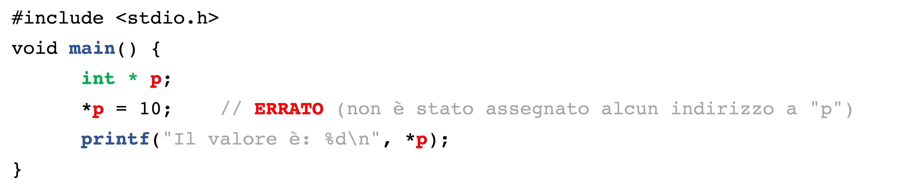
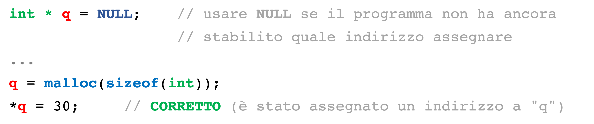
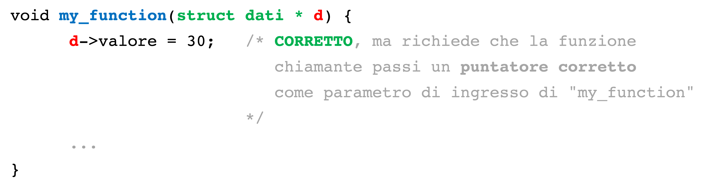

# Esercitazione di approfondimento sul debugging

Anche se il programma compila correttamente, è possibile che si verifichino errori durante l'esecuzione. Un errore frequente è l'utilizzo errato dei puntatori: il programma legge/scrive in memoria usando un puntatore che contiene un indirizzo di memoria errato. In questo caso, la CPU solleva una eccezione (es. "indirizzo illegale"), che il sistema operativo gestisce "uccidendo" il processo.

Il seguente esempio è un caso di puntatore non usato correttamente.



L'esecuzione del programma termina forzatamente, e la shell mostra il messaggio *"Errore di segmentazione"* (*"Segmentation Fault"*).

```
$ gcc -o pointer pointer.c
$ ./pointer
Errore di segmentazione
```

I seguenti esempi sono casi di corretto utilizzo dei puntatori.

Uso di `malloc()`.


Altro uso di `malloc()`, preceduto da NULL.


Passaggio di parametri tramite puntatore.



Per diagnosticare la causa di un *Segmentation Fault*, è necessario raccogliere più informazioni dal sistema operativo. È possibile abilitare il salvataggio della memoria del processo (*"core dump"*) al momento della terminazione. Con un debugger, è possibile aprire il core dump e leggere le informazioni sulle cause della terminazione. In particolare, si potrà conoscere quale è l'istruzione del programma che ha fatto uso di un puntatore con indirizzo invalido.

- Passo 1: Ricompilare il programma per abilitare le informazioni di debugging (aggiungere opzione `-g`).

```
$ gcc -g -o pointer pointer.c
```

- Passo 2: Abilitare il salvataggio dei core dump.
```
$ sudo bash -c 'echo core > /proc/sys/kernel/core_pattern'
$ ulimit -c unlimited 
```

- Passo 3: Eseguire il programma, e riprodurre il malfunzionamento.
```
$ ./pointer
Errore di segmentazione (core dump creato)
```

- Passo 4: Nella cartella corrente apparirà un file di nome `core.12345`. Il numero rappresenta il PID del processo terminato. Aprire il file con il debugger (`gdb`).
```
$ gdb -c core.12345 ./pointer
(gdb)
````

- Passo 5: La stringa `(gdb)` (prompt) indica che il debugger è in attesa di direttive. Digitare il comando `bt` (backtrace) seguito da INVIO. Questo comanndo stampa la funzione in esecuzione al momento della terminazione. Inoltre, stampa la lista delle funzioni chiamanti.
```
(gdb) bt
#0  0x000055970fe27159 in main () at pointer.c:7
#1  0x00007f134da3cd90 in __libc_start_call_main (main=main@entry=0x55970fe27149 <main>, argc=argc@entry=1, argv=argv@entry=0x7ffddd9d5078) at ../sysdeps/nptl/libc_start_call_main.h:58
#2  0x00007f134da3ce40 in __libc_start_main_impl (main=0x55970fe27149 <main>, argc=1, argv=0x7ffddd9d5078, init=<optimized out>, fini=<optimized out>, rtld_fini=<optimized out>, stack_end=0x7ffddd9d5068) at ../csu/libc-start.c:392
#3  0x000055970fe27085 in _start ()
```

Il programma è terminato alla linea 7 del file `pointer.c`. La linea si trova all'interno della funzione `main()`. Si ignorino le funzioni elencate subito dopo il `main()`.

- Passo 6: Digitare `quit` e INVIO per chiudere il debugger
```
(gdb) quit
$
```


**Esercizio**: Risolvere il [programma con errore in fase di esecuzione, nella cartella "segmentation-fault/"](segmentation-fault). Si utilizzi il debugger per risalire al puntatore che causa il malfunzionamento.

